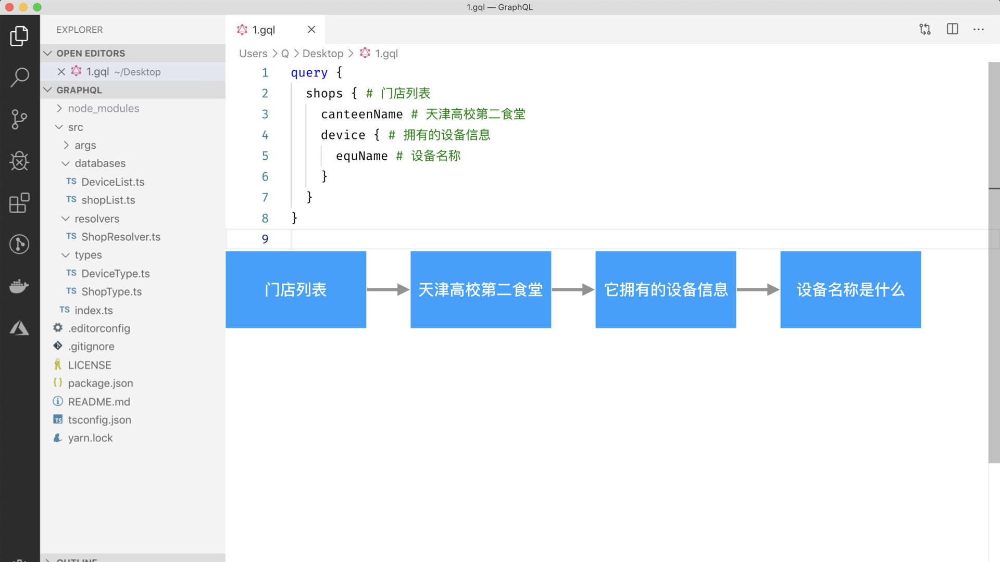
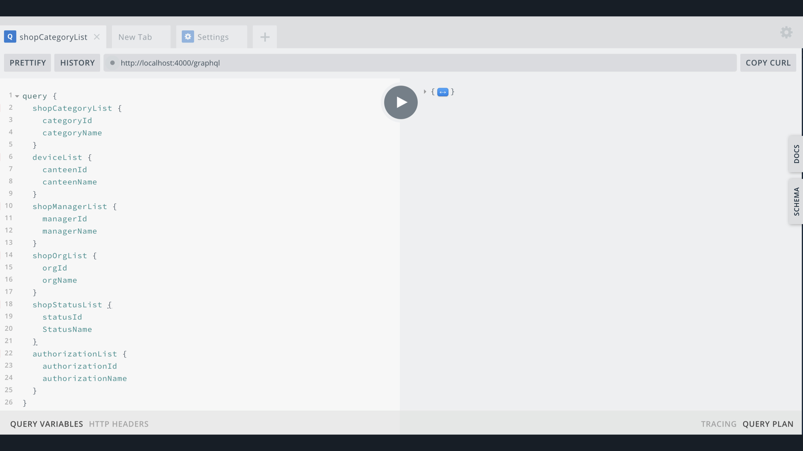

# GraphQL 演讲内容

### 演讲 PPT 在线版








### 启动项目

一、克隆项目、安装依赖、启动 GraphQL 服务
```sh
git clone https://github.com/wubaiqing/GraphQL.git && \
cd GraphQL && \
yarn install && \
yarn start
```

二、访问本地服务  
[http://localhost:4000/graphql](http://localhost:4000/graphql)

三、执行查询门店列表案例
```graphql
query {
  shops {
    canteenId
    canteenName
    canteenAddress
  }
}
```

四、执行查询门店列表和门店详情案例
```graphql
query {
  shop(index: 0) {
    canteenName
  }
  shops {
    canteenId
    canteenName
    canteenAddress
  }
}
```

五、类型扩展案例
```graphql
query {
  shop(index: 0) {
    device {
      equId
      equName
    }
  }
  shops {
    device {
      equId
      equName
    }
  }
}
```


### 整个 Demo 类型定义
```graphql
type DeviceType {
  canteenId: Int!
  equId: Int!
  equName: String!
  createTime: String
}

type Mutation {
  createShop(canteenName: String!, canteenAddress: String!): ShopType!
}

type Query {
  shop(index: Float!): ShopType!
  shops(offset: Float = 0): [ShopType!]!
  countShop: Int!
}

type ShopType {
  canteenId: Int!
  canteenName: String!
  canteenAddress: String!
  createTime: String!
  device: DeviceType
}
```

### 学习链接
- [type-graphql 官方网站](https://github.com/19majkel94/type-graphql#readme)  
- [reflect-metadata 什么是元数据介绍](https://ninghao.net/blog/7384)  
- [apollo-server-express 基于 express 框架的 Apollo 服务的封装，它还支持 Koa2、Hapi 等等](https://github.com/apollographql/apollo-server#readme)  
